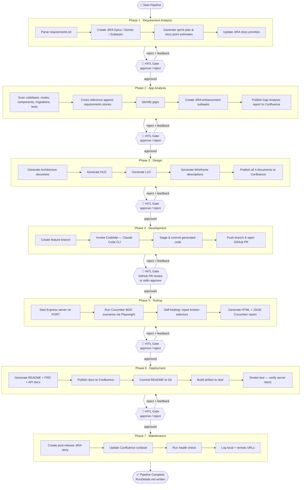
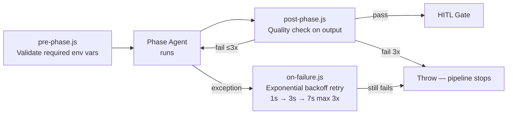

# CSTS SDLC Pipeline Overview

AI-driven, end-to-end software delivery pipeline for the Customer Support Ticket System.  
Each phase runs an autonomous agent, applies pre/post hooks, and pauses at a **Human-in-the-Loop (HITL)** gate before the next phase begins.

---

## Pipeline Flow



---

## Phase Details

### Phase 1 — Requirement Analysis

**Persona:** Business Analyst  
**Input:** `requirements/requirements.txt`  
**Output:** JIRA Epic → Stories → Subtasks + sprint plan applied to JIRA

| Step | Task |
|------|------|
| 1 | Read and parse `requirements.txt` — structured with `EPIC:`, `STORY:`, `TASK:`, `Description:` markers |
| 2 | Create JIRA **Epic** for each top-level group |
| 3 | Create JIRA **Story** under each Epic |
| 4 | Create JIRA **Subtask** under each Story |
| 5 | Apply sprint assignments, story point estimates, and priorities back to each story via JIRA PUT |

**Tech Stack**

| Tool | Purpose |
|------|---------|
| Node.js | Runtime |
| JIRA REST API v3 | Create Epic / Story / Subtask, update story fields |
| `requirements/requirements.txt` | Plain-English requirements source |

---

### Phase 2 — App Analysis

**Persona:** Solutions Analyst  
**Input:** Codebase scan + `requirements/requirements.txt`  
**Output:** Gap report in Confluence, JIRA enhancement subtasks

| Step | Task |
|------|------|
| 1 | Scan `backend/routes/` for implemented API endpoints |
| 2 | Scan `frontend/src/` for UI components |
| 3 | Scan `backend/migrations/` for database schema |
| 4 | Scan `tests/features/` for existing test scenarios |
| 5 | Cross-reference against requirement stories to identify gaps |
| 6 | Create JIRA enhancement subtasks for each gap |
| 7 | Publish formatted Gap Analysis report to Confluence |

**Tech Stack**

| Tool | Purpose |
|------|---------|
| Node.js | Runtime + codebase scanning (`fs.readdirSync`) |
| JIRA REST API v3 | Create enhancement subtasks |
| Confluence REST API v2 | Create / update Gap Analysis page |

---

### Phase 3 — Design

**Persona:** Solution Architect  
**Input:** Requirements + gap analysis  
**Output:** 4 Confluence pages (Architecture, HLD, LLD, Wireframes)

| Step | Task |
|------|------|
| 1 | Generate Architecture document (system components, data flow, deployment topology) |
| 2 | Generate High-Level Design (HLD) — module breakdown, API contracts |
| 3 | Generate Low-Level Design (LLD) — class/DB schema detail, sequence diagrams |
| 4 | Generate Wireframe descriptions (UI layout per screen) |
| 5 | Publish all 4 as individual Confluence pages (create or update) |

**Tech Stack**

| Tool | Purpose |
|------|---------|
| Node.js | Runtime |
| Confluence REST API v2 | Create / update design pages in Confluence space |

---

### Phase 4 — Development

**Persona:** Full-Stack Developer  
**Input:** Design documents  
**Output:** Feature branch + GitHub PR

| Step | Task |
|------|------|
| 1 | Checkout new feature branch `feature/ai-enhancements-<timestamp>` |
| 2 | Invoke **CodeMie (Claude Code CLI)** to generate code from design docs |
| 3 | Stage all changes (`git add .`) |
| 4 | Commit with structured message |
| 5 | Push branch to GitHub remote |
| 6 | Open GitHub Pull Request against `main` |

**Tech Stack**

| Tool | Purpose |
|------|---------|
| Node.js | Runtime |
| Git CLI | Branch, commit, push |
| GitHub REST API | Create Pull Request |
| Claude Code CLI (CodeMie) | AI code generation from design specs |

**HITL note:** This is the only phase that also accepts GitHub PR review approval from a second reviewer. All other phases use stdin only.

---

### Phase 5 — Testing

**Persona:** QA Engineer  
**Input:** Running application  
**Output:** Cucumber test report (HTML + JSON)

| Step | Task |
|------|------|
| 1 | Start Express backend server on `PORT` (default 3001) |
| 2 | Wait for `/health` endpoint to respond |
| 3 | Run Cucumber BDD scenarios using `@cucumber/cucumber` |
| 4 | Playwright drives Chromium headless for each step |
| 5 | On selector failure, self-healing tries 4 strategies: `data-testid`, `aria-label`, text content, role |
| 6 | Healed selectors are written back to the step file and logged to `tests/healing-log.json` |
| 7 | Generate HTML and JSON reports in `tests/cucumber-report/` |

**Tech Stack**

| Tool | Purpose |
|------|---------|
| Node.js | Runtime |
| `@cucumber/cucumber` | BDD test runner (Gherkin feature files) |
| `@playwright/test` | Browser automation (Chromium headless) |
| Self-healing (`workflow/self-healing/playwright-healer.js`) | Repair broken selectors automatically |

---

### Phase 6 — Deployment

**Persona:** DevOps + Technical Writer  
**Input:** Tested codebase  
**Output:** Confluence docs + built artifact in `dist/`

| Step | Task |
|------|------|
| 1 | Generate / update `README.md` |
| 2 | Generate Functional Requirements Document (FRD) |
| 3 | Generate API documentation |
| 4 | Publish FRD + API docs to Confluence |
| 5 | Commit README to Git |
| 6 | Run `npm run build` (frontend) + package backend into `dist/` |
| 7 | Count artifact files; smoke-test that the server starts |

**Tech Stack**

| Tool | Purpose |
|------|---------|
| Node.js | Runtime |
| Confluence REST API v2 | Publish FRD and API docs |
| Git CLI | Commit README |
| npm / webpack | Frontend build |

---

### Phase 7 — Maintenance

**Persona:** DevOps / Support  
**Input:** Deployed artifact  
**Output:** JIRA post-release story + Confluence runbook + health check

| Step | Task |
|------|------|
| 1 | Create JIRA story for post-release monitoring tasks |
| 2 | Create or update Confluence runbook page |
| 3 | Hit `GET /health` on the local server and record status |
| 4 | Log local URL (and Render/cloud URL if `RENDER_URL` env is set) |

**Tech Stack**

| Tool | Purpose |
|------|---------|
| Node.js | Runtime |
| JIRA REST API v3 | Create post-release story |
| Confluence REST API v2 | Create / update runbook page |

---

## Hooks & Self-Healing



| Hook | File | What it does |
|------|------|-------------|
| Pre-phase | `workflow/hooks/pre-phase.js` | Checks all required env vars are set before the phase runs |
| Post-phase | `workflow/hooks/post-phase.js` | Validates the phase output has required fields (e.g. `prUrl`, `exitCode === 0`) |
| On-failure | `workflow/hooks/on-failure.js` | Catches agent exceptions and retries with exponential backoff (max 3 attempts) |
| Self-healing | `workflow/self-healing/playwright-healer.js` | Repairs broken Playwright selectors using 4 fallback strategies; logs to `tests/healing-log.json` |

---

## Running the Pipeline

```bash
# Full pipeline (foreground — required for HITL stdin)
node workflow/orchestrator.js

# Resume from a specific phase
node workflow/orchestrator.js testing

# Available phases
# requirement_analysis | app_analysis | design | development | testing | deployment | maintenance
```

At each HITL gate the terminal shows the phase output summary and waits:

```
Type "approve" to proceed, or "reject <feedback>" to re-run with changes.
```
