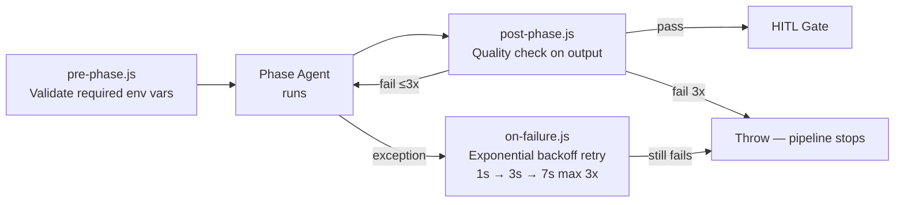

# CSTS SDLC Pipeline Overview

AI-driven, end-to-end software delivery pipeline for the Customer Support Ticket System.  
Each phase runs an autonomous agent, applies pre/post hooks, and pauses at a **Human-in-the-Loop (HITL)** gate before the next phase begins.

---

## The Orchestrator

**File:** `workflow/orchestrator.js`

The orchestrator is the central nervous system of the pipeline. It does not perform any SDLC work itself — it sequences, guards, and recovers every phase that does.

### What it does

| Responsibility | Detail |
|---|---|
| **Sequences phases** | Runs all 7 phases in order; can resume from any phase via CLI arg |
| **Pre-phase validation** | Calls `pre-phase.js` before each agent — checks required env vars are set |
| **Phase execution** | Invokes the correct agent with HITL feedback if the phase was previously rejected |
| **Auto-retry on failure** | Catches agent exceptions, delegates to `on-failure.js` (exponential backoff, ×3) |
| **Output quality check** | Calls `post-phase.js` after each agent — rejects incomplete output and auto-reruns (×3) |
| **HITL gate** | Pauses after every phase; development uses GitHub PR + stdin, all others use stdin only |
| **Rejection handling** | On rejection: re-runs with feedback (up to 3 times), then prompts: re-run / restart from phase / abort |
| **Run report** | Stores each phase's output, records start time, writes `RunDetails.md` when pipeline completes |

### When each part fires

```
node workflow/orchestrator.js
        │
        ├─► [Phase loop: for each phase]
        │       │
        │       ├─► pre-phase.js          ← env var check
        │       ├─► phase agent.run()     ← actual SDLC work
        │       │       └─► on-failure.js ← if agent throws (auto-retry ×3, backoff 1s→3s→7s)
        │       ├─► post-phase.js         ← quality check on output (auto-retry ×3)
        │       ├─► store phaseOutputs    ← saved for the run report
        │       ├─► HITL gate             ← human approves or rejects
        │       │       └─► if reject     ← re-run same phase with feedback (×3 max)
        │       └─► mark phase complete
        │
        └─► writeRunDetails()             ← RunDetails.md written once, at the end
```

### Why it matters

| Problem without it | How the orchestrator solves it |
|---|---|
| Phases run in wrong order or independently | Enforces the correct sequence every time via single entry point |
| Missing env var causes cryptic mid-phase crash | Pre-hook catches it before the phase even starts |
| Flaky API takes down the whole run | On-failure hook retries automatically |
| Bad output silently flows into the next phase | Post-hook rejects incomplete output before it propagates |
| No human review before risky steps | HITL gate blocks progression until a human explicitly approves |
| Hard to recover after partial failure | `startFrom` arg lets you resume from any phase |
| No record of what a run produced | `RunDetails.md` written automatically with every link and status |

---

## Pipeline Flow


---

## Phase Details

### Phase 1 — Requirement Analysis

**Files:** `workflow/phases/requirement_analysis.js` → `analysis.js` + `plan.js`  
**Persona:** Business Analyst  
**Input:** `requirements/requirements.txt`  
**Output:** JIRA Epic → Stories → Subtasks + sprint plan applied to JIRA

#### What the agent does

Runs two sub-agents back-to-back:

**Sub-agent 1 — BA Analysis (`analysis.js`)**

| Step | Task |
|------|------|
| 1 | Read and parse `requirements.txt` — structured with `EPIC:`, `STORY:`, `TASK:`, `Description:` markers |
| 2 | Create JIRA **Epic** for each top-level group |
| 3 | Create JIRA **Story** under each Epic |
| 4 | Create JIRA **Subtask** under each Story |

**Sub-agent 2 — Sprint Planner (`plan.js`)**

| Step | Task |
|------|------|
| 5 | Load sprint plan (3 sprints, story-point estimates per story) |
| 6 | Apply sprint name, story points, and priority to each JIRA story via PUT |
| 7 | Return structured plan: sprints, total story points, estimated duration |

#### When it runs
First phase of every pipeline run. Can also be run standalone: `node workflow/phases/requirement_analysis.js`.

#### Why it's helpful
Converts a plain-English requirements file into a fully structured JIRA backlog with sprint assignments in one shot — no manual ticket creation required. If the HITL reviewer rejects the output, any feedback typed at the gate is passed as context to the next attempt.

#### Tech Stack

| Tool | Purpose |
|------|---------|
| Node.js | Runtime |
| JIRA REST API v3 | `POST /rest/api/3/issue` to create Epic/Story/Subtask; `PUT` to update story fields |
| `requirements/requirements.txt` | Plain-English requirements source |

---

### Phase 2 — App Analysis

**File:** `workflow/phases/app_analysis.js`  
**Persona:** Solutions Analyst  
**Input:** Codebase scan + `requirements/requirements.txt`  
**Output:** Gap report in Confluence, JIRA enhancement subtasks

#### What the agent does

| Step | Task |
|------|------|
| 1 | Scan `backend/routes/` for implemented API endpoints |
| 2 | Scan `frontend/src/` for UI components |
| 3 | Scan `backend/migrations/` for database schema |
| 4 | Scan `tests/features/` for existing test scenarios |
| 5 | Cross-reference discovered inventory against requirement stories |
| 6 | Build a gap list — requirements with no matching implementation |
| 7 | Create JIRA enhancement subtasks for each gap (parented under the relevant story) |
| 8 | Publish a formatted Gap Analysis report to Confluence |

#### When it runs
Immediately after Requirement Analysis is approved. Depends on JIRA stories already existing (created in Phase 1).

#### Why it's helpful
Acts as a bridge between "what we said we'd build" and "what actually exists in the codebase". Without this phase, gaps drift silently into later phases. By creating JIRA subtasks automatically, every gap is tracked and visible to the team before design begins.

#### Tech Stack

| Tool | Purpose |
|------|---------|
| Node.js | Runtime + codebase scanning (`fs.readdirSync`, regex on source files) |
| JIRA REST API v3 | `POST /rest/api/3/issue` — create enhancement subtasks |
| Confluence REST API v2 | Create / update Gap Analysis page in the configured space |

---

### Phase 3 — Design

**File:** `workflow/phases/design.js`  
**Persona:** Solution Architect  
**Input:** Requirements + gap analysis  
**Output:** 4 Confluence pages (Architecture, HLD, LLD, Wireframes)

#### What the agent does

| Step | Task |
|------|------|
| 1 | Generate Architecture document — system components, data flow, deployment topology, AI integration points |
| 2 | Generate HLD — module breakdown, API contracts, inter-service communication |
| 3 | Generate LLD — DB schema, class-level detail, sequence diagrams, error handling |
| 4 | Generate Wireframe descriptions — UI layout per screen, component interactions |
| 5 | Check if each page already exists in Confluence (by title search) |
| 6 | Create new pages or update existing ones — returns page IDs for the run report |

#### When it runs
After App Analysis is approved. The generated content is self-contained — it does not read existing Confluence pages.

#### Why it's helpful
Produces all four design artefacts in one phase rather than requiring an architect to author them manually. Each document is stored in Confluence where the team can annotate and review before development begins. Page IDs are captured so RunDetails.md can link directly to each document.

#### Tech Stack

| Tool | Purpose |
|------|---------|
| Node.js | Runtime |
| Confluence REST API v2 | `GET` to search by title; `POST` to create; `PUT` to update page content |

---

### Phase 4 — Development

**File:** `workflow/phases/development.js`  
**Persona:** Full-Stack Developer  
**Input:** Design documents  
**Output:** Feature branch + GitHub PR (`{ prUrl, prNumber, branch }`)

#### What the agent does

| Step | Task |
|------|------|
| 1 | Checkout new feature branch `feature/ai-enhancements-<timestamp>` |
| 2 | Invoke **CodeMie (Claude Code CLI)** to generate frontend + backend code from design specs |
| 3 | Stage all changes (`git add .`) |
| 4 | Commit with a structured message |
| 5 | Push branch to GitHub remote |
| 6 | Create a GitHub Pull Request against `main` with a summary of features |

#### When it runs
After Design is approved. The branch timestamp prevents name collisions across multiple runs.

#### Why it's helpful
Automates the most time-consuming phase of any sprint — going from design to working code. The PR creation means the output is immediately visible and reviewable by the team before it merges. This is also the only phase with a **dual HITL path**: a second GitHub reviewer can approve the PR directly, or the person running the pipeline can type `approve` in the terminal — whichever comes first.

#### Tech Stack

| Tool | Purpose |
|------|---------|
| Node.js | Runtime |
| Git CLI (`execSync`) | Create branch, commit, push |
| GitHub REST API | `POST /repos/{owner}/{repo}/pulls` — create Pull Request |
| Claude Code CLI — CodeMie | AI code generation driven by design documents |

---

### Phase 5 — Testing

**Files:** `workflow/phases/testing.js` → `workflow/phases/qa.js`  
**Persona:** QA Engineer  
**Input:** Running application  
**Output:** Cucumber report + test stats (`{ exitCode, totalScen, passedScen, failedScen, healed }`)

#### What the agent does

| Step | Task |
|------|------|
| 1 | Start Express backend server on `PORT` (default 3001) using `spawn` |
| 2 | Poll `/health` every second until the server responds (30 s timeout) |
| 3 | Run all Cucumber BDD scenarios via `execSync npx cucumber-js` |
| 4 | Playwright drives Chromium headless for every browser interaction step |
| 5 | On selector failure, self-healing tries 4 strategies in order: `data-testid` → `aria-label` → text content → role |
| 6 | Healed selectors are rewritten back into the step file and logged to `tests/healing-log.json` |
| 7 | Parse stdout for scenario / step pass/fail counts |
| 8 | Generate HTML and JSON reports in `tests/cucumber-report/` |
| 9 | Return `exitCode: 0` on full pass, `exitCode: 1` on any failure |

#### When it runs
After Development is approved. The server is spawned fresh by the agent on every run and killed after tests complete.

#### Why it's helpful
Closes the loop between generated code and verified behaviour — if CodeMie produced broken code, the Cucumber scenarios catch it here before deployment. Self-healing means a selector change in the UI doesn't fail the pipeline; the agent fixes the test and records what it changed, keeping the test suite durable across UI iterations.

#### Tech Stack

| Tool | Purpose |
|------|---------|
| Node.js (`spawn`, `execSync`) | Spawn server process; run Cucumber CLI |
| `@cucumber/cucumber` | BDD test runner — Gherkin `.feature` files in `tests/features/` |
| `@playwright/test` | Browser automation — Chromium headless launched via `world.js` |
| Self-healing (`workflow/self-healing/playwright-healer.js`) | 4-strategy selector repair; rewrites step files; logs to `tests/healing-log.json` |

---

### Phase 6 — Deployment

**Files:** `workflow/phases/deployment.js` → `documentation.js` + `build.js`  
**Persona:** DevOps + Technical Writer  
**Input:** Tested codebase  
**Output:** Confluence docs + built artifact (`{ readmePath, frdId, confluenceUrl, artifactPath, publicFiles, serverFiles }`)

#### What the agent does

Runs two sub-agents back-to-back:

**Sub-agent 1 — Documentation (`documentation.js`)**

| Step | Task |
|------|------|
| 1 | Generate / update `README.md` with project description, setup, and API reference |
| 2 | Generate Functional Requirements Document (FRD) |
| 3 | Generate API documentation (endpoint list, request/response schemas) |
| 4 | Publish FRD + API docs to Confluence (create or update by title) |
| 5 | Commit README to the current Git branch |

**Sub-agent 2 — Build (`build.js`)**

| Step | Task |
|------|------|
| 6 | Run `npm run build` in `frontend/` to produce the static bundle |
| 7 | Copy frontend build + backend source into `dist/` |
| 8 | Count public (frontend) and server (backend) files |
| 9 | Smoke-test: spawn server from `dist/`, verify it starts |

#### When it runs
After Testing is approved. All test scenarios must pass (post-hook checks `exitCode === 0`) before this phase runs.

#### Why it's helpful
Bundles documentation and build into one gate — the reviewer sees both the living docs in Confluence and the artifact size before approving. Nothing is deployed until a human confirms the artifact and docs are correct.

#### Tech Stack

| Tool | Purpose |
|------|---------|
| Node.js | Runtime |
| Confluence REST API v2 | Create / update FRD and API docs pages |
| Git CLI (`execSync`) | Commit README to current branch |
| npm + webpack | Frontend production build |

---

### Phase 7 — Maintenance

**File:** `workflow/phases/maintenance.js`  
**Persona:** DevOps / Support  
**Input:** Deployed artifact  
**Output:** JIRA story + Confluence runbook + health check (`{ jiraKey, confPageId, healthStatus, localUrl, renderUrl }`)

#### What the agent does

| Step | Task |
|------|------|
| 1 | Create a JIRA story under the project Epic for post-release monitoring tasks |
| 2 | Check if a runbook page already exists in Confluence (by title search) |
| 3 | Create or update the Confluence runbook — includes health check endpoint, local/cloud URLs, rollback notes |
| 4 | Hit `GET /health` on the local server and record the returned status |
| 5 | Log `localUrl` (`http://localhost:PORT`) and `renderUrl` (from `RENDER_URL` env) |
| 6 | Return page ID + JIRA key so the run report can link directly to both |

#### When it runs
Final phase — runs after Deployment is approved. This is the only phase with no downstream dependency; pipeline is complete after this gate.

#### Why it's helpful
Closes the pipeline with a formal handover artefact: a JIRA story that signals to the support team that a release happened, and a Confluence runbook that tells them how to operate it. The health check confirms the server is reachable immediately after deployment — any misconfiguration is caught before the HITL gate, not after the pipeline is marked complete.

#### Tech Stack

| Tool | Purpose |
|------|---------|
| Node.js | Runtime |
| JIRA REST API v3 | `POST /rest/api/3/issue` — create post-release story |
| Confluence REST API v2 | `GET` search by title; `POST` create or `PUT` update runbook page |
| `https` (built-in) | `GET /health` smoke-check against running server |

---

## Hooks & Self-Healing



| Hook | File | What it does |
|------|------|-------------|
| Pre-phase | `workflow/hooks/pre-phase.js` | Checks all required env vars are set before the phase runs |
| Post-phase | `workflow/hooks/post-phase.js` | Validates the phase output has required fields (e.g. `prUrl`, `exitCode === 0`) |
| On-failure | `workflow/hooks/on-failure.js` | Catches agent exceptions and retries with exponential backoff (max 3 attempts) |
| Self-healing | `workflow/self-healing/playwright-healer.js` | Repairs broken Playwright selectors using 4 fallback strategies; logs to `tests/healing-log.json` |

---

## Running the Pipeline

```bash
# Full pipeline (foreground — required for HITL stdin)
node workflow/orchestrator.js

# Resume from a specific phase
node workflow/orchestrator.js testing

# Available phases
# requirement_analysis | app_analysis | design | development | testing | deployment | maintenance
```

At each HITL gate the terminal shows the phase output summary and waits:

```
Type "approve" to proceed, or "reject <feedback>" to re-run with changes.
```
